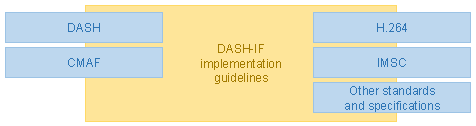

# Purpose # {#why-does-this-document-exist}

The guidelines defined in this document support the creation of interoperable services for high-quality video distribution based on MPEG-DASH and related standards. These guidelines are provided in order to address DASH-IF members' needs and industry best practices. The guidelines support the implementation of conforming service offerings as well as DASH client implementations.

While alternative interpretations may be equally valid in terms of standards conformance, services and clients created following the guidelines defined in this document can be expected to exhibit highly interoperable behavior between different implementations.

# Interpretation # {#interpretation}

Requirements in this document describe service and client behaviors that DASH-IF considers interoperable.

If a **service provider** follows these requirements in a published DASH service, the published DASH service is likely to experience successful playback on a wide variety of clients and exhibit graceful degradation when a client does not support all features used by the service.

If a **client implementer** follows the client-oriented requirements described in this document, the DASH client will play content conforming to this document provided that the client device media platform supports all features used by a particular DASH service (e.g. the codecs and DRM systems).

This document uses statements of fact when describing normative requirements defined in referenced specifications such as [[!DASH]] and [[!CMAF]]. References are typically provided to indicate where the requirements are defined.

[[!RFC2119]] statements (e.g. "SHALL", "SHOULD" and "MAY") are used when this document defines a new requirement or further constrains a requirement from a referenced document.

Statement of fact:

* A DASH presentation **is** a sequence of consecutive non-overlapping periods [[!DASH]].

New or more constrained requirement:

* Segments **SHALL NOT** use the MPEG-TS container format.

All DASH [=presentations=] are assumed to be conforming to these guidelines. A service MAY explicitly signal itself as conforming by including the string `https://dashif.org/guidelines/` in `MPD@profiles`.

There is no strict backward compatibility with previous versions - best practices change over time and what was once considered sensible may be replaced by a superior approach later on. Therefore, clients and services that were conforming to version N of this document are not guaranteed to conform to version N+1.

# Disclaimer # {#legal}

This is a document made available by DASH-IF. The technology embodied in this document may involve the use of intellectual property rights, including patents and patent applications owned or controlled by any of the authors or developers of this document. No patent license, either implied or express, is granted to you by this document. DASH-IF has made no search or investigation for such rights and DASH-IF disclaims any duty to do so. The rights and obligations which apply to DASH-IF documents, as such rights and obligations are set forth and defined in the DASH-IF Bylaws and IPR Policy including, but not limited to, patent and other intellectual property license rights and obligations. A copy of the DASH-IF Bylaws and IPR Policy can be obtained at http://dashif.org/.

The material contained herein is provided on an "AS IS" basis and to the maximum extent permitted by applicable law, this material is provided AS IS, and the authors and developers of this material and DASH-IF hereby disclaim all other warranties and conditions, either express, implied or statutory, including, but not limited to, any (if any) implied warranties, duties or conditions of merchantability, of fitness for a particular purpose, of accuracy or completeness of responses, of workmanlike effort, and of lack of negligence.

In addition, this document may include references to documents and/or technologies controlled by third parties. Those third party documents and technologies may be subject to third party rules and licensing terms. No intellectual property license, either implied or express, to any third party material is granted to you by this document or DASH-IF. DASH-IF makes no any warranty whatsoever for such third party material.

Note that technologies included in this document and for which no test and conformance material is provided, are only published as a candidate technologies, and may be removed if no test material is provided before releasing a new version of this guidelines document. For the availability of test material, please check http://www.dashif.org.

# DASH and related standards # {#dash-is-important}

DASH (dynamic adaptive streaming over HTTP) [[!DASH]] is a technology for adaptive media delivery. Initially published by ISO/IEC in April 2012, it has been continually updated, with the 4th edition published in 2020.

CMAF (common media application format) [[!CMAF]] is a media container format based on ISO Base Media File Format [[!ISOBMFF]]. It defines data structures for media delivery compatible with DASH and other similar technologies such as [[HLS]]. Initially published by ISO/IEC in 2018, it has been updated in 2019 with the publishing of the 2nd edition.

This document is based on the 4th edition DASH [[!DASH]] and 2nd edition CMAF [[!CMAF]] specifications.

DASH together with related standards and specifications is the foundation for an ecosystem of services and clients that work together to enable audio/video/text and related content to be presented to end-users.

<figure>
	
	<figcaption>This document connects DASH with international standards and industry specifications.</figcaption>
</figure>

[[!DASH]] defines a highly flexible set of building blocks that needs to be constrained to ensure interoperable behavior in common scenarios. The necessary media container constraints are largely defined by [[!CMAF]] and [[!DASH-CMAF]]. This document defines further constraints to limit DASH features to those that are considered appropriate for use in interoperable clients and services.

Clients consuming DASH content will need to interact with the host device's media platform. The guidelines in this document assume that the media platform implements APIs that are equivalent to Media Source Extensions [[media-source]] and Encrypted Media Extensions [[encrypted-media]]. API level compatibility is not required but equivalent features are expected.

This document was generated in close coordination with [[DVB-DASH]]. The features are aligned to the extent considered reasonable. The tools and features are aligned to the extent considered reasonable. In addition, DASH-IF worked closely with ATSC to develop a DASH profile for ATSC3.0 for broadcast distribution [[ATSC3]].

## Structure of a DASH presentation ## {#what-is-dash}

[[!DASH]] specifies the structure of a DASH <dfn>presentation</dfn>, which consists primarily of:

1. The manifest or <dfn>MPD</dfn>, which describes the content and how it can be accessed.
1. Data containers that clients will download during playback of a [=presentation=] in order to obtain media samples.

<figure>
	
	<figcaption>Relationships of primary DASH data structures and the standards they are defined in.</figcaption>
</figure>

The [=MPD=] is an XML file that follows a schema defined in [[!DASH]]. Various 3rd party extension points are defined in the XML schema. This document defines some extensions, as do other industry specifications.

[[!DASH]] defines two data container formats, one based on [[!ISOBMFF]] and the other [[!MPEG2TS]]. However, only the former is used in modern solutions. This document only supports services using the [[!ISOBMFF]] container format.

[[!CMAF]] is a constrained media format based on [[!ISOBMFF]], specifically designed for adaptive streaming. This document requires the use of [[!CMAF]] compatible data containers. The requirements for the usage of CMAF with DASH are defined by [[!DASH-CMAF]].

Note: The relationship to [[!CMAF]] is constrained to the container format, as primarily expressed by [[!DASH-CMAF]]. In particular, there is no requirement to conform to [[!CMAF]] media profiles.

The data container format defines the physical structure of the following components of a [=presentation=]:

1. Each [=representation=] contains an initialization segment.
1. Each [=representation=] contains any number of [=media segments=].
1. Some [=representations=] may contain an index segment, depending on the [=addressing mode=] used.

Note: HLS (HTTP Live Streaming) [[HLS]] is an adaptive media delivery technology similar to DASH that also supports CMAF. Under certain constraints, content conforming to CMAF can be delivered to clients using both DASH and HLS.

## Terminology cross-reference across standards ## {#terms-cross-reference}

Different documents often use different terms to refer to the same structural components of DASH [=presentations=]. A quick cross-reference of terms commonly found causing confusion is presented here:

<figure id="cmaf-terms">
	<table class="data">
		<thead>
			<tr>
				<th>[[!DASH]]
				<th>[[!CMAF]]
				<th>[[!ISOBMFF]]
		<tbody>
			<tr>
				<td>(media) segment, subsegment
				<td>CMAF segment
				<td>
			<tr>
				<td>initialization segment
				<td>CMAF header
				<td>
			<tr>
				<td>index segment, segment index
				<td>
				<td>segment index box (`sidx`)
	</table>
	<figcaption>Cross-reference of closely related terms in different standards.</figcaption>
</figure>

## Terminology choices in this document ## {#confusing-terms}

This document is intended to be a set of guidelines easily understood by solution designers and developers. In the interest of ease of understanding, some important adjustments in terminology are made compared to the underlying standards, described here.

[[!DASH]] has the concept of "segment" (URL-addressable media object) and "subsegment" (byte range of URL-addressable media object), whereas [[!CMAF]] does not make such a distinction. This document uses [[!CMAF]] terminology, with the term "segment" in this document being equivalent to "CMAF segment". The term "segment" in this document may be equivalent to either "segment" or "subsegment" in [[!DASH]], depending on the [=addressing mode=] used.

This document's concept of the [=MPD timeline=] is not directly expressed in [[!DASH]]. To improve understandability of the timing model, this document splits the DASH concept of "presentation timeline" ([[!DASH]] 7.2.1) into two separate concepts: the aggregated component ([=MPD timeline=]) and the [=representation=] specific component ([=sample timeline=]). These concepts are distinct but mutually connected via metadata in the [=MPD=].

[[!DASH]] uses "representation" to refer to a set of files and associated metadata, with the same "representation" possibly used in different parts of a DASH [=presentation=] and/or in different [=presentations=]. This document uses [=representation=] to refer to an individual instance of a [[!DASH]] "representation" - a set of data in an [=MPD=] that references some files containing media samples. Using the same files in two places effecticely means using two [=representations=], whereas in [[!DASH]] terminology it would be valid to call that a single [=representation=] used with individual conditions/caveats that apply to each usage. The deviation in terminology is intentional as it simplifies understanding and avoids having to juggle the two concepts (as the "shared" view is typically not relevant).