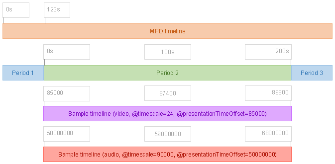
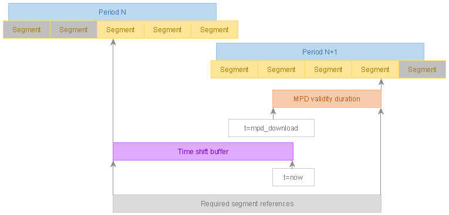
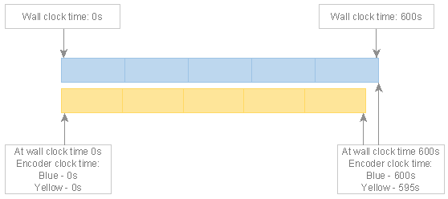

# Goal of the interoperable timing model # {#timing}

The purpose of this document is to give a holistic overview of DASH [=presentation=] timing and segment addressing, explaining the existing building blocks and rules defined by [[!DASH]] and adding further constraints to achieve greater interoperability between DASH services and clients.

[[!DASH]] 4.3 and 7.2.1 define the high-level structure and timing concepts of DASH, with [[!DASH-CMAF]] further relating them to [[!CMAF]] concepts. The DASH-IF implementation guidelines allow considerably less flexibility in timing than provided by [[!DASH]], constraining services to a specific set of reasonably flexible behaviors that are highly interoperable with modern client platforms.

This document defines an interoperable timing model and documents segment addressing logic suitable for interoperable use cases. Alternative interpretations of DASH timing may be equally valid from a standards conformance viewpoint.

# MPD timeline # {#mpd-general-timeline}

The [=MPD=] defines the <dfn>MPD timeline</dfn> of a DASH [=presentation=], which serves as the baseline for all scheduling decisions made during playback and establishes the relative timing of [=periods=] and [=media segments=]. The [=MPD timeline=] informs DASH clients on when it can download and present which [=media segments=]. The contents of an [=MPD=] are a promise by a DASH service to make specific [=media segments=] [=available=] during specific time spans described by the [=MPD timeline=].

Values on the [=MPD timeline=] are all ultimately relative to the zero point of the [=MPD timeline=], though possibly through several layers of indirection (e.g. period A is relative to period B, which is relative to the zero point).

The ultimate purpose of the [=MPD=] is to enable the client to obtain media samples for playback. The [=MPD=] also provides the information required for a DASH client to dynamically switch between different bitrates of the same content (in different [=representations=]) to adapt to changing network conditions.

The following [=MPD=] elements are most relevant to locating and scheduling the media samples:

1. The [=MPD=] describes consecutive [=periods=] which map data onto the [=MPD timeline=].
1. Each [=period=] describes of one or more [=representations=], each of which provides media samples inside a sequence of [=media segments=] located via [=segment references=]. [=Representations=] contain independent [=sample timelines=] that are mapped to the time span on the [=MPD timeline=] that belongs to the [=period=].
1. [=Representations=] within a [=period=] are grouped into adaptation sets, which associate related [=representations=] and decorate them with metadata.

<figure>
	
	<figcaption>The primary contents of a [=presentation=], described by an [=MPD=].</figcaption>
</figure>

# Presentation timing characteristics # {#timing-and-presentation-types}

There exist two types of DASH [=presentations=], indicated by `MPD@type` [[!DASH]]:

* In a a <dfn>static presentation</dfn> (`MPD@type="static"`) any [=media segment=] may be presented at any time. The DASH client is in complete control over what content is presented when and the entire [=presentation=] is [=available=] at any time.
* In a <dfn>dynamic presentation</dfn> (`MPD@type="dynamic"`) the [=MPD timeline=] is mapped to [=wall clock=] time, with each [=media segment=] on the [=MPD timeline=] intended to be presented at a specific moment in time (with some client-chosen [=time shift=] allowed).
	* Furthermore, [=media segments=] may become [=available=] and cease to be [=available=] with the passage of time.
	* [[#timing-mpd-updates|The MPD may change over time]], enabling the structure of the [=presentation=] to change over time (e.g. when a new title in the [=presentation=] is offered with a different set of languages).

In a [=dynamic presentation=], the zero point of the [=MPD timeline=] is the mapped to the point in [=wall clock=] time indicated by the <dfn>effective availability start time</dfn>, which is formed by taking `MPD@availabilityStartTime` and applying any `LeapSecondInformation` offset ([[!DASH]] 5.3.9.5 and 5.13). This allows a [=wall clock=] time to be associated with each [=media segment=], indicating the moment the [=media segment=] is intended to be presented. The zero point of the [=MPD timeline=] will move when leap seconds occur ([[!DASH]] 5.13). See also [[#leap-seconds]].

`MPD@mediaPresentationDuration` MAY be present in an [=MPD=]. If present, it SHALL accurately match the duration between the zero point on the [=MPD timeline=] and the end of the last [=period=], including the duration of any XLink [=periods=]. Clients SHALL calculate the total duration of a [=static presentation=] by adding up the durations of each [=period=] and SHALL NOT rely on the presence of `MPD@mediaPresentationDuration`.

Note: This calculation is necessary because the durations of XLink [=periods=] can only be known after the XLink is resolved. Therefore it is impossible to always determine the total [=MPD=] duration on the service side as only the client is guaranteed to have access to all the required knowledge (the contents of the XLink [=periods=]).

# Period timing # {#period-timing}

An [=MPD=] defines an ordered list of one or more consecutive non-overlapping <dfn>periods</dfn> ([[!DASH]] 5.3.2). A [=period=] is both a time span on the [=MPD timeline=] and a definition of the data to be presented during this time span. [=Period=] timing is relative to the zero point of the [=MPD timeline=], though often indirectly (being relative to the previous [=period=]).

<figure>
	
	<figcaption>An [=MPD=] defines a collection of consecutive non-overlapping [=periods=].</figcaption>
</figure>

[=Periods=] are self-contained - a service SHALL NOT require a client to know the contents of another [=period=] in order to correctly present a [=period=]. Knowledge of the contents of different periods MAY be used by a client to achieve seamless [=period=] transitions, especially when working with [[#timing-connectivity|period-connected representations]].

Common reasons for defining multiple [=periods=] are:

* Assembling a presentation from multiple self-contained pieces of content.
* Inserting ads in the middle of existing content and/or replacing spans of existing content with ads.
* Adding/removing certain [=representations=] as the nature of the content changes (e.g. a new title starts with a different set of offered languages).
* Updating period-scoped metadata (e.g. codec configuration or DRM signaling).

The below [=MPD=] consists of two 20-second [=periods=]. The duration of the first [=period=] is calculated using the start point of the second [=period=]. The total duration of the [=presentation=] is 40 seconds.

<xmp highlight="xml">
<MPD xmlns="urn:mpeg:dash:schema:mpd:2011" type="static">
	<Period>
		...
	</Period>
	<Period start="PT20S" duration="PT20S">
		...
	</Period>
</MPD>
</xmp>

Parts of the [=MPD=] structure that are not relevant for this chapter have been omitted - this is not a fully functional [=MPD=] file.

A [=period=] SHALL NOT have a duration of zero. [=MPD=] generators are expected to remove any [=periods=] that are, for any reason, assigned a duration of zero. This might happen, for example, due to ad insertion logic deciding not to insert any ad or due to a packager not receiving any content to insert into the period. Clients SHALL ignore [=periods=] with a duration of zero.

## First and last period timing in static presentations ## {#timing-period-static}

In a [=static presentation=], the first [=period=] SHALL start at the zero point of the [=MPD timeline=] (with a `Period@start` value of 0 seconds).

In a [=static presentation=], the last [=period=] SHALL have a `Period@duration`.

## First and last period timing in dynamic presentations ## {#timing-period-dynamic}

In a [=dynamic presentation=], the first [=period=] SHALL start at or after the zero point of the [=MPD timeline=]  (with a `Period@start` value of 0 seconds or greater).

In a [=dynamic presentation=], the last [=period=] MAY have a `Period@duration`, in which case it has a fixed duration. If without `Period@duration`, the last [=period=] in a [=dynamic presentation=] has an unlimited duration (that may later be shortened by an [=MPD=] update).

Note: A [=period=] with an unlimited duration can be converted to fixed duration by an [=MPD=] update, so even a nominally unlimited duration is effectively constrained by the [=MPD validity duration=] of the current [=MPD=] snapshot.

# Representation timing # {#representation-timing}

<dfn>Representations</dfn> provide the content for [=periods=]. A [=representation=] is a sequence of [=media segments=], an initialization segment, an optional index segment and related metadata ([[!DASH]] 5.3.1 and 5.3.5).

The [=MPD=] describes each [=representation=] using a `Representation` element. For each [=representation=], the [=MPD=] defines a set of <dfn>segment references</dfn> to the [=media segments=] and metadata describing the media samples provided by the [=representation=]. The [=segment references=] and much of the metadata are shared by all [=representations=] in the same adaptation set.

Each [=representation=] belongs to exactly one adaptation set and exactly one [=period=], although [[#timing-connectivity|a representation may be connected with a representation in another period]].

The below [=MPD=] consists of a single 20-second [=period=] with three video, one audio and one text [=representation=]. Each [=representations=] supplies the [=period=] with 20 seconds of media samples.

<xmp highlight="xml">
<MPD xmlns="urn:mpeg:dash:schema:mpd:2011" type="static">
	<Period duration="PT20S">
		<AdaptationSet>
			<Representation id="1" mimeType="video/mp4" codecs="avc1.64001f" bandwidth="386437" />
			<Representation id="2" mimeType="video/mp4" codecs="avc1.640028" bandwidth="1117074" />
			<Representation id="3" mimeType="video/mp4" codecs="avc1.640033" bandwidth="2723012" />
		</AdaptationSet>
		<AdaptationSet lang="en">
			<Representation id="4" mimeType="audio/mp4" codecs="mp4a.40.29" bandwidth="131351" />
		</AdaptationSet>
		<AdaptationSet lang="en-US">
			<Representation id="5" mimeType="application/mp4" codecs="wvtt" bandwidth="428" />
		</AdaptationSet>
	</Period>
</MPD>
</xmp>

Parts of the [=MPD=] structure that are not relevant for this chapter have been omitted - this is not a fully functional [=MPD=] file.

## Sample timeline ## {#timing-sampletimeline}

The samples within a [=representation=] exist on a linear <dfn>sample timeline</dfn> defined by the encoder that created the samples. [=Sample timelines=] are mapped onto the [=MPD timeline=] by metadata stored in or referenced by the [=MPD=] ([[!DASH]] 7.3.2).

<figure>
	
	<figcaption>A [=sample timeline=] is mapped onto the [=MPD timeline=] based on parameters defined in the [=MPD=], relating the media samples provided by a [=representation=] to the portion of the [=MPD timeline=] covered by the [=period=] that references the [=representation=]. The [=sample timelines=] extend further beyond the range of the [=period=] (full extents not illustrated).</figcaption>
</figure>

The [=sample timeline=] does not determine what samples are presented. It merely connects the timing of the [=representation=] to the [=MPD timeline=] and allows the correct [=media segments=] to be identified when a DASH client makes scheduling decisions driven by the [=MPD timeline=].

The same [=sample timeline=] is shared by all [=representations=] in the same adaptation set [[!DASH-CMAF]]. [=Representations=] in different adaptation sets MAY use different [=sample timelines=].

A [=sample timeline=] is linear - encoders are expected to use an appropriate [=timescale=] and sufficiently large timestamp fields to avoid any wrap-around. If wrap-around does occur, a new [=period=] must be started in order to establish a new [=sample timeline=].

The [=sample timeline=] is formed after applying any [[!ISOBMFF]] edit lists ([[!DASH]] 7.3.2).

A [=sample timeline=] is measured in <dfn>timescale units</dfn> defined as a number of units per second ([[!DASH]] 5.3.9.2 and 5.3.9.6). This value (the <dfn>timescale</dfn>) SHALL be present in the MPD as `SegmentTemplate@timescale` or `SegmentBase@timescale` (depending on the [=addressing mode=]).

Note: While optional in [[!DASH]], the presence of the `@timescale` attribute is required by the interoperable timing model because the default value of 1 is unlikely to match any real-world content and is far more likely to indicate an unintentional content authoring error.

<figure>
	
	<figcaption>`@presentationTimeOffset` is the key component in establishing the relationship between the [=MPD timeline=] and a [=sample timeline=].</figcaption>
</figure>

The zero point of a [=sample timeline=] may be at the start of the [=period=] or at any earlier point. The point on the [=sample timeline=] indicated by `@presentationTimeOffset` is equivalent to the [=period=] start point on the [=MPD timeline=] ([[!DASH]] 5.3.9.2). The value is provided by `SegmentTemplate@presentationTimeOffset` or `SegmentBase@presentationTimeOffset`, depending on the [=addressing mode=], and has a default value of 0 [=timescale units=].

Note: To transform a [=sample timeline=] position `SampleTime` to an [=MPD timeline=] position, use the formula `MpdTime = Period@start + (SampleTime - @presentationTimeOffset) / @timescale`.

## Referencing media segments ## {#timing-segment-references}

Each [=segment reference=] addresses a [=media segment=] that corresponds to a specific time span on the [=sample timeline=].

The exact mechanism used to define [=segment references=] depends on the [=addressing mode=] used by the representation. All [=representations=] in the same adaptation set SHALL use the same [=addressing mode=].

Advisement: The sequence of [=segment references=] provided for a [=representation=] SHALL NOT leave gaps between [=media segments=] or define overlapping [=media segments=].

The portion of the [=period=] that a [=representation=] must provide [=media segments=] for depends on the type of the [=presentation=], with the requirements for each type described below.

### Necessary segment references in static presentations ### {#necessary-references-static}

In a [=static presentation=], a [=representation=] SHALL provide enough [=media segments=] to cover the entire time span of the [=period=].

<figure>
	
	<figcaption>In a [=static presentation=], the entire [=period=] must be covered with [=media segments=].</figcaption>
</figure>

### Necessary segment references in dynamic presentations ### {#necessary-references-dynamic}

In a [=dynamic presentation=], a [=representation=] SHALL provide enough [=media segments=] to cover the time span of the [=period=] that intersects with the [=time shift buffer=] at any point during the [=MPD validity duration=].

<figure>
	
	<figcaption>In a [=dynamic presentation=], the [=time shift buffer=] and [=MPD validity duration=] determine the set of required [=segment references=] for each [=representation=]. [=Media segments=] filled with gray need not be referenced due to falling outside the [=time shift buffer=] in its maximum extents during the [=MPD validity duration=], despite falling within the bounds of a [=period=].</figcaption>
</figure>

Note: In the above example, the second [=period=] is shown as extending beyond the end of the [=MPD validity duration=] (e.g. because it is of unlimited length), which effectively increases the [=time shift buffer=] to the end of the [=MPD validity duration=]. If the second [=period=] were shorter, the range of required segment references would terminate with the end of the [=period=].

It is a valid and common situation that a [=media segment=] is required to be referenced but is not yet [=available=]. See also [[#timing-availability]].

### Removal of unnecessary segment references ### {#unnecessary-segment-references}

An <dfn>unnecessary segment reference</dfn> is one that is not defined as required by [[#necessary-references-static]] or [[#necessary-references-dynamic]].

In a [=static presentation=], the [=MPD=] SHALL NOT contain [=unnecessary segment references=], except for [=representations=] that use [=indexed addressing=] in which case such [=segment references=] MAY be present.

In a [=dynamic presentation=], the [=MPD=] SHALL NOT contain [=unnecessary segment references=] except when any of the following applies, in which case an [=unnecessary segment reference=] MAY be present:

1. The [=segment reference=] is for future content and will eventually become necessary.
1. The [=segment reference=] is defined via [=indexed addressing=].
1. The [=segment reference=] is defined by an `<S>` element that uses `S@r` to define multiple [=segment references=], some of which are necessary.
1. Removal of the [=segment reference=] is not allowed by [[#timing-mpd-updates-remove-content|content removal constraints]].

## Alignment of periods and representations ## {#timing-period-representation-alignment}

[=Segment start points=] and [=segment end points=] do not need to be aligned with [=period=] start/end points ([[!DASH]] 7.2.1). The general expectation is that only the content that falls within the [=period=] time span is presented by DASH clients. Allowing for overflow outside this time span ensures that [=periods=] can be easily started and ended at arbitrary positions on the [=MPD timeline=] without leaving gaps. Starting and ending [=periods=] is an editorial decision that is typically independent of the technical structure of the contents of the [=period=].

<figure>
	
	<figcaption>[=Media segments=] and samples need not align with [=period=] boundaries. Some samples may be entirely outside a [=period=] (marked gray) and some may overlap the [=period=] boundary (yellow).</figcaption>
</figure>

Clients SHALL NOT present any samples from [=media segments=] that are entirely outside the [=period=], even if such [=media segments=] are referenced.

If a [=media segment=] overlaps a [=period=] boundary, clients SHOULD NOT present the samples that lie outside the [=period=] and SHOULD present the samples that lie either partially or entirely within the [=period=].

Note: In the end, which samples are presented is entirely up to the client. It may sometimes be impractical to present [=media segments=] only partially, depending on the capabilities of the client platform, the type of media samples involved and any dependencies between samples.

As perfect alignment between sample and [=period=] boundaries cannot be expected, clients MAY incur small [=time shift=] in either direction (within extents permitted by this document) when playing a [=dynamic presentation=] and transitioning in/out of a [=period=] where the sample and [=period=] boundaries are not aligned.

# Clock drift is forbidden # {#no-clock-drift}

Some encoders experience clock drift - they do not produce exactly 1 second worth of output per 1 second of input, either stretching or compressing the [=sample timeline=] with respect to the [=MPD timeline=].

<figure>
	
	<figcaption>Comparison of an encoder correctly tracking [=wall clock=] time (blue) and an encoder with a clock that runs 0.8% too slowly (yellow), leading it to producing fewer seconds of content than expected (the correct amount of content has been temporally compressed by the encoder to fit into a smaller number of seconds). A DASH packager cannot use the yellow encoder's output as-is or it would violate the DASH timing model, which requires services to track [=wall clock=] time, and potentially lead to track de-synchronization.</figcaption>
</figure>

Clock drift not only causes timing model violations when an insufficient amount of data is produced but also leads to de-synchronization of content in tracks encoded based on different clocks. [[!CMAF]] 6.3 and 6.6.8 require tracks to be synchronized.

Note: A lack of data at the current [=wall clock=] time or in the past is typically a violation of the timing model, whereas there is no explicit restriction on providing data in the future.

To detect clock drift, one can check for the presence/absence of data near the current [=wall clock=] time. If data from now or the immediate past is absent, possibly the encoder has a slow clock. If data from the future is present, possibly the encoder has a fast clock. Furthermore, gradual de-synchronization of content in different tracks over a long play duration is a clear sign of clock drift on one or more of the involved encoders.

It would be unreasonable to expect DASH clients to counteract clock drift by performing their own timeline stretching or compressing during playback, even if provided with the information about clock differences. DASH clients are based on very limited media platform APIs that typically lack the capability for any such compensation. Therefore, a DASH service SHALL NOT publish content that suffers from clock drift.

The solution is to adjust the encoder so that it correctly tracks [=wall clock=] time, e.g. by performing regular small adjustments to the encoder clock to counteract any "natural" drift it may be experiencing. The exact implementation depends on the encoder timing logic and is out of scope of this document.

## Workarounds for clock drift ## {#clock-drift-ugly-hacks}

If the encoder cannot be adjusted to not suffer from clock drift, the only remaining option is to post-process its output to bring the [=presentation=] into conformance with the timing model. The facilities available to the packager are likely less powerful than those available to the encoder - it is unlikely that re-encoding/re-timing the media samples is practical in the packager. Furthermore, this type of adjustment will not eliminate track de-synchronization that will be present unless the clocks used to encode all tracks drift at the same rate.

DASH packagers are responsible for generating DASH [=presentations=] that conform to targeted standards or specifications and cannot assume perfect encoder implementations. It is a fact that some encoders suffer from clock drift. DASH packagers SHOULD implement workarounds to ensure the [=presentation=] is conforming to targeted standards and specifications. This may require some some unavoidable disruption of the end-user experience.

The following are examples of approaches a DASH packager could use to bring content from an encoder suffering clock drift into conformance:

1. Drop a span of content if input is produced faster than real-time.
1. Insert regular padding content if input is produced slower than real-time. This padding can take different forms:
	* Silence or a blank picture.
	* Repeating frames.
	* Insertion of short-duration [=periods=] where the affected [=representations=] are not present.

Such after-the-fact corrective actions can be disruptive and only serve as a backstop to prevent complete playback failure cased by timing model violations. Such workarounds might be satisfactory when correcting for very small drift rates, with any disruptions being relatively rare.

# Media segments # {#timing-mediasegment}

A <dfn>media segment</dfn> is an HTTP-addressable data structure that contains media samples, referenced by an [=MPD=] via a [=segment reference=]. The structure of a [=media segment=] is that of a CMAF segment consisting of one or more CMAF fragments [[!DASH-CMAF]]. Different [=media segments=] may be different byte ranges accessed on the same URL.

Advisement: The segment-related terminology in this document is aligned with [[!CMAF]] rather than [[!DASH]]. See [[#confusing-terms]] to better understand the differences.

[=Media segments=] contain one or more consecutive media samples and consecutive [=media segments=] in the same [=representation=] contain consecutive media samples [[!CMAF]].

A [=media segment=] contains the media samples that exactly match the time span on the [=sample timeline=] associated with a [=media segment=] via a [=segment reference=] ([[!DASH]] 7.2.1 and [[!DASH-CMAF]]), except when using [=simple addressing=] in which case a certain amount of inaccuracy may be present as defined in [[#addressing-simple-inaccuracy]].

Advisement: All timing-related clauses in this document refer to the nominal timing described in the [=MPD=] unless otherwise noted. DASH clients are expected to operate with nominal times in playback logic, even if the real values differ due to permitted amounts of inaccuracy.

The <dfn>segment start point</dfn> is the point on the [=MPD timeline=] where the [=media segment=] starts according to the [=segment reference=] obtained from the [=MPD=]. The <dfn>segment end point</dfn> is the [=segment start point=] plus the [=media segment=] duration defined by the [=segment reference=].

Note: In [[!DASH]] terminology, the [=segment start point=] is often equivalent to "earliest presentation time" of the [=media segment=]. However, this relation does not always hold true as "earliest presentation time" is defined in terms of media sample timing which is affected by the inaccuracy allowed under [=simple addressing=]. In contrast, the [=segment start point=] is always the nominal start point and is not affected by any potential timing inaccuracy.

[=Media segments=] in different [=representations=] of the same adaptation set are aligned ([[!CMAF]] 7.3.4 and [[!DASH-CMAF]]). This means they contain media samples for the same time span on the [=sample timeline=]. This is true even if using [=simple addressing=] with [[#addressing-simple-inaccuracy|inaccurate media segment timing]]. That is, not only is the nominal timing aligned but so is the true media sample timing inside the [=media segments=].

# Period connectivity # {#timing-connectivity}

In certain circumstances content may be offered such that the contents of one adaptation set are technically compatible with the contents an adaptation set in a previous [=period=] ([[!DASH]] 5.3.2.4). Such adaptation sets are <dfn>period-connected</dfn>.

The main characteristic of connectivity is that initialization segments of [=representations=] with matching `@id` in [=period-connected=] adaptation sets are functionally equivalent ([[!DASH]] 5.3.2.4). That is, the initialization segment of a [=representation=] in one [=period-connected=] adaptation set can be used to initialize playback of a [=representation=] with matching `@id` in the other [=period-connected=] adaptation set. Connectivity is typically achieved by using the same encoder to encode the content of multiple [=periods=] using the same settings.

Advisement: In encrypted content the content key identifier `default_KID` is part of the initialization segment. Using a different content key breaks period connectivity that would otherwise exist due to matching codec configuration.

Adaptation sets SHALL NOT be signaled as [=period-connected=] if the set of [=representations=] in them is different, even if all shared [=representations=] remain compatible.

Note: The above constraint removes some ambiguity from the [[!DASH]] definition, which does not explicitly state whether it is allowed to only have a subset of [=representations=] that is connected. [GitHub #387](https://github.com/Dash-Industry-Forum/DASH-IF-IOP/issues/387)

An [=MPD=] MAY contain unrelated [=periods=] between [=periods=] that contain [=period-connected=] adaptation sets.[=Period=] connectivity MAY be chained across any number of [=periods=].

[=Period-connected=] adaptation sets content SHOULD be signaled in the [=MPD=] as [=period-connected=]. This signaling helps clients ensure seamless playback across [=period=] transitions.

<figure>
	
	<figcaption>Adaptation sets can be signaled as [=period-connected=], enabling client optimizations. Arrows on diagram indicate direction of connectivity reference (from future to past), with the implied message being "the client can use the same decoder configuration it used where the arrow points to".</figcaption>
</figure>

The [=sample timelines=] of [=representations=] in [=period-connected=] adaptation sets MAY be discontinuous between two [=periods=] (e.g. due to encoder clock wrap-around or skipping some content as a result of editorial decisions). See also [[#timing-continuity]].

The following signaling in the [=MPD=] indicates that two adaptation sets are [=period-connected=] across two [=periods=] ([[!DASH]] 5.3.2.4):

* The adaptation set in the second [=period=] has a supplemental property descriptor with:
	* `@shemeIdUri` set to `urn:mpeg:dash:period-connectivity:2015`.
	* `@value` set to the `Period@id` of the first period.

The [=period-connected=] adaptation sets have the same `@id` and the same set of `Representation@id` values ([[!DASH]] 5.3.2.4).

## Segment reference duplication during connected period transitions ## {#connectivity-duplicates}

As a [=period=] may start and/or end in the middle of a [=media segment=], the same [=media segment=] may simultaneously be referenced by two [=period-connected=] adaptation sets, with one part of it scheduled for playback during the first [=period=] and the other part during the second [=period=]. This is likely to be the case when no [=sample timeline=] discontinuity is introduced by the transition.

<figure>
	
	<figcaption>The same [=media segment=] will often exist in two [=periods=] at a [=period-connected=] transition. On the diagram, this is segment 4.</figcaption>
</figure>

Clients SHOULD NOT present a [=media segment=] twice when it occurs on both sides of a [=period=] transition in a [=period-connected=] adaptation set.

Clients SHOULD ensure seamless playback of [=period-connected=] adaptation sets in consecutive [=periods=]. Clients unable to ensure seamless playback MAY incur some amount of [=time shift=] at the [=period=] transition point provided that the resulting [=time shift=] is permitted by the timing model.

Note: The exact mechanism that ensures seamless playback depends on client capabilities and will be implementation-specific. Any shared [=media segment=] overlapping the [=period=] boundary may need to be detected and deduplicated to avoid presenting it twice.

## Period continuity ## {#timing-continuity}

In addition to [[#timing-connectivity|period connectivity]], [[!DASH]] 5.3.2.4 defines [=period=] continuity. Continuity is a special case of [=period=] connectivity that indicates no timeline discontinuity is present at the transition point between the media samples of the two continuous [=periods=]. Under continuity conditions, the client is expected to be able to continue seamless playback by merely appending [=media segments=] from the new [=period=], without any reconfiguration at the [=period=] boundary.

Continuity SHALL NOT be signaled if the first/last sample in the [=media segment=] on the [=period=] boundary does not exactly start/end on the [=period=] boundary. This cannot be expected to be generally true, as [=period=] boundaries are often an editorial decision independent of the [=media segment=] and sample layout.

Note: This further constrains usage of continuity compared to [[!DASH]], which does not require the boundary samples to actually be the first/last sample in the [=media segment=]. However, that interpretation leaves room for incompatible implementations depending on how the client handles [[#connectivity-duplicates|deduplication of duplicate segments at period boundaries]] (which would be required under the rules of the interoperable timing model in order to not leave a gap).

[=Period=] continuity MAY be signaled in the MPD when the above condition is met, in which case period connectivity SHALL NOT be simultaneously signaled on the same [=representation=]. Continuity implies connectivity ([[!DASH]] 5.3.2.4).

The signaling of [=period=] continuity is the same as for [=period=] connectivity, except that the value to use for `@schemeIdUri` is `urn:mpeg:dash:period-continuity:2015` ([[!DASH]] 5.3.2.4).

Clients MAY take advantage of any platform-specific optimizations for seamless playback that knowledge of [=period=] continuity enables; beyond that, clients SHALL treat continuity the same as connectivity.

# Dynamic presentations # {#timing-dynamic}

The requirements in this section and its subsections only apply to [=dynamic presentations=].

The following factors primarily differentiate [=dynamic presentations=] from [=static presentations=]:

1. The [=media segments=] of a [=dynamic presentation=] may become [=available=] over time and cease to be [=available=] after the passage of time. That is, not all segments are necessarily [=available=] at all times.
1. Playback of a [=dynamic presentation=] is synchronized to a [=wall clock=] (with some amount of client-chosen [=time shift=] allowed).
1. The [=MPD=] of a [=dynamic presentation=] may change over time, with each snapshot having a limited [=MPD validity duration=] and clients regularly downloading new snapshots of the [=MPD=].

The below [=MPD=] consists of two 300-second [=periods=]. The duration of the first [=period=] is calculated using the start point of the second [=period=]. The total duration of the presentation is 600 seconds.

The [=dynamic presentation=] was intended to be presented starting at 09:35 UTC on December 2, 2017, allowing for up to 400 seconds of [=time shift=] by the DASH client. By the absence of `MPD@minimumUpdatePeriod`, the [=MPD=] indicates that its contents will never change.

The absence of an `LeapSecondInformation` element indicates the service provider does not expect the service to remain accessible for long enough to encounter a leap second.

<xmp highlight="xml">
<MPD xmlns="urn:mpeg:dash:schema:mpd:2011" type="dynamic"
	availabilityStartTime="2017-12-02T09:35:00Z" timeShiftBufferDepth="PT400S">
	<Period>
		...
	</Period>
	<Period start="PT300S" duration="PT300S">
		...
	</Period>
</MPD>
</xmp>

Parts of the [=MPD=] structure that are not relevant for this chapter have been omitted - this is not a fully functional [=MPD=] file.

The requirements in this document mandate the removal of expired content and expired [=MPDs=]. Given the 2017 date marked in the [=MPD=], this example is obviously expired in its entirety. The necessary removal of expired content from within the [=MPD=] has been omitted for purposes of illustration.

## Clock synchronization ## {#clock-sync}

During playback of [=dynamic presentations=], a wall <dfn>wall clock</dfn> is used as the timing reference for DASH client decisions. This is a synchronized clock shared by the DASH client and service. With the exception of clock adjustments performed by the DASH client for synchronization purposes, the time indicated by the [=wall clock=] increases at real time speed (1 second per second), regardless of the duration of content that has been presented by the DASH client.

It is critical to synchronize the clocks of the DASH client and service when using a [=dynamic presentation=] because the [=MPD timeline=] of a [=dynamic presentation=] is mapped to [=wall clock=] time and many playback decisions are clock driven and assume a common understanding of time by the DASH client and service.

The time indicated by the [=wall clock=] does not necessarily need to match some universal standard as long as the DASH client and service are mutually synchronized.

Clock synchronization mechanisms are described by `UTCTiming` elements in the [=MPD=] ([[!DASH]] 5.8.4.11).

The [=MPD=] of a [=dynamic presentation=] SHALL include at least one `UTCTiming` element that defines a clock synchronization mechanism. If multiple `UTCTiming` elements are listed, their order determines the order of preference [[!DASH]].

A client presenting a [=dynamic presentation=] SHALL synchronize its local clock according to the `UTCTiming` elements in the [=MPD=] and SHALL emit a warning or error to application developers when clock synchronization fails, no `UTCTiming` elements are defined or none of the referenced clock synchronization mechanisms are supported by the client.

A DASH client SHALL NOT use a synchronization method that is not listed in the [=MPD=] unless explicitly instructed to do so by the application developer.

Advisement: The use of a "default time source" by DASH clients is not allowed because this often obscures interoperability problems and introduces inconsistent behavior due to device clock differences.

The set of time synchronization mechanisms SHALL be restricted to the following subset of schemes from among those defined in [[!DASH]] 5.8.5.7:

	* `urn:mpeg:dash:utc:http-xsdate:2014`
	* `urn:mpeg:dash:utc:http-iso:2014`
	* `urn:mpeg:dash:utc:http-head:2014`
	* `urn:mpeg:dash:utc:direct:2014`

Issue: We could benefit from some detailed examples here, especially as clock sync is such a critical element of live services.

## Leap seconds ## {#leap-seconds}

[=Dynamic presentations=] that cross the boundary between December/January or June/July ([[LEAP-SECONDS]]) need to correctly represent the effects of leap seconds to DASH clients, which shift the [=MPD timeline=] start point. Under the model defined by [[!DASH]] 5.13, clients are informed of necessary leap second adjustments via the [=MPD=].

The [=MPD=] of a [=dynamic presentations=] SHALL publish leap second offset information in the [=MPD=], in the form of a `LeapSecondInformation` element as defined by [[!DASH]] 5.13, unless the service provider does not intend for the [=presentation=] to remain accessible long enough to encounter a December/January or June/July transition in the UTC timezone.

Clients SHALL process leap second offset information (and any updates received due to [=MPD refreshes=]) in order to accurately calculate the [=effective availability start time=].

## Availability ## {#timing-availability}

A [=media segment=] is <dfn>available</dfn> when an HTTP request to acquire the [=media segment=] can be started and successfully performed to completion by a client ([[!DASH]] 3.1.6). During playback of a [=dynamic presentation=], new [=media segments=] continuously become [=available=] and stop being [=available=] with the passage of time.

An <dfn>availability window</dfn> is a time span on the [=MPD timeline=] that determines which [=media segments=] clients can expect to be [=available=].

Each adaptation set has its own [=availability window=]. Services SHALL NOT define [=MPD=] attributes that affect the [=availability window=] on the [=representation=] level.

<figure>
	
	<figcaption>The [=availability window=] determines which [=media segments=] can be expected to be [=available=], based on where their [=segment end point=] lies.</figcaption>
</figure>

The [=availability window=] is calculated as follows:

1. Let <var>now</var> be the current wall clock time according to the [=wall clock=].
1. Let <var>AvailabilityWindowStart</var> be <code><var>now</var> - MPD@timeShiftBufferDepth</code>.
	* If `MPD@timeShiftBufferDepth` is not defined, let <var>AvailabilityWindowStart</var> be the [=effective availability start time=].
1. Let <var>TotalAvailabilityTimeOffset</var> be the sum of all `@availabilityTimeOffset` values that apply to the adaptation set, either via `SegmentBase`, `SegmentTemplate` or `BaseURL` elements ([[!DASH]] 5.3.9.5.3).
1. The [=availability window=] is the time span from <var>AvailabilityWindowStart</var> to <code><var>now</var> + <var>TotalAvailabilityTimeOffset</var></code>.

[=Media segments=] that have their [=segment end point=] inside or at the end of the [=availability window=] are [=available=] [[!DASH]].

Note: [[!DASH]] 4.3 and 5.3.9 define "segment availability time" of a segment as the span of [=wall clock=] time during which that [=media segment=] is available. Consequently, the [=availability window=] at each moment is **approximately** equivalent to the union of "segment availability times" of all [=available=] [=media segments=] at that moment.

Advisement: It is the responsibility of the DASH service to ensure that [=media segments=] are [=available=] to clients when they are described as [=available=] by the [=MPD=] [[!DASH]]. Keep in mind that the criterium for availability is a successful download by clients, not successful publishing from a packager.

Clients MAY at any point attempt to acquire any [=media segments=] that the [=MPD=] signals as [=available=]. Clients SHALL NOT attempt to acquire [=media segments=] that the [=MPD=] does not signal as [=available=].

Despite best efforts, DASH services occasionally fail to achieve the [=availability windows=] advertised in the [=MPD=]. To ensure robust behavior even in the face of imperfect services, clients SHOULD NOT assume that [=media segments=] described by the [=MPD=] as [=available=] are [=available=] and SHOULD implement appropriate retry/fallback behavior to account for timing errors by slow-publishing or eagerly-unpublishing services.

## Time shift buffer ## {#timing-timeshift}

The <dfn>time shift buffer</dfn> is a time span on the [=MPD timeline=] that defines the set of [=media segments=] that a client is allowed to present at the current moment in time according to the [=wall clock=] (`now`).

This is the mechanism by which clients can introduce a <dfn>time shift</dfn> (an offset) between [=wall clock=] time and the [=MPD timeline=] when presenting [=dynamic presentations=]. The [=time shift=] is zero when a client is presenting the [=media segment=] at the end point of the [=time shift buffer=]. By playing back [=media segments=] from further in the past, a positive [=time shift=] is introduced.

Note: A [=time shift=] of 30 seconds means that the client starts presenting a [=media segment=] at the moment when its position on the [=MPD timeline=] reaches a distance of 30 seconds from the end of the [=time shift buffer=].

The following additional factors further constrain the set of [=media segments=] that can be presented at the current time. These factors often force a client to introduce a [=time shift=]:

1. [[#timing-availability]] - not every [=media segment=] in the time shift buffer is guaranteed to be [=available=].
1. [[#timing-delay]] - the service may define a delay that forbids the use of a section of the [=time shift buffer=].

The [=time shift buffer=] extends from `now - MPD@timeShiftBufferDepth` to `now`. In the absence of `MPD@timeShiftBufferDepth` the start of the [=time shift buffer=] is the [=effective availability start time=].

<figure>
	
	<figcaption>[=Media segments=] overlapping the [=time shift buffer=] may potentially be presented by a client if other constraints do not forbid it.</figcaption>
</figure>

Clients MAY present samples from [=media segments=] that overlap (either in full or in part) the time shift buffer, assuming no other constraints forbid it. Clients SHALL NOT present samples from [=media segments=] that are entirely outside the [=time shift buffer=] (whether in the past or the future).

The start of the [=time shift buffer=] MAY be before the start of the first [=period=]. Common reasons for this are:

* The [=presentation=] just started and there is not enough content to fill the [=time shift buffer=].
* The service is published with an effectively infinite [=time shift buffer=] (up to the zero point of the [=MPD timeline=] as indicated by the [=effective availability start time=]).

A [=dynamic presentation=] SHALL contain a [=period=] that ends at or overlaps the end point of the [=time shift buffer=], except when reaching [[#timing-mpd-updates-theend|the end of live content]] in which case the last [=period=] MAY end before the end of the [=time shift buffer=].

Clients SHALL NOT allow seeking into regions of the [=time shift buffer=] that are not covered by [=periods=], regardless of whether such regions are before or after the [=periods=] described by the [=MPD=].

## Presentation delay ## {#timing-delay}

There is a natural conflict between the [=availability window=] and the [=time shift buffer=]. It is legal for a client to present [=media segments=] as soon as they overlap the [=time shift buffer=], yet such [=media segments=] might not yet be [=available=].

Furthermore, the delay between [=media segments=] entering the [=time shift buffer=] and becoming [=available=] might be different for different [=representations=] that use different [=media segment=] durations. This difference may also change over time if a [=representation=] does not use a constant [=media segment=] duration.

The mechanism that allows DASH clients to resolve this conflict is the <dfn>presentation delay</dfn>, which decreases the [=time shift buffer=] by moving its end point into the past, creating an [=effective time shift buffer=] with a reduced duration.

Clients SHALL calculate a suitable [=presentation delay=] to ensure that the [=media segments=] it schedules for playback are [=available=] and that there is sufficient time to download them once they become [=available=].

Issue: Can we recommend some meaningful algorithm for this? Something to use as a starting point would be nice to provide.

The information required to calculate an optimal [=presentation delay=] might not always be available to DASH clients (e.g. because the client is not yet aware of upcoming [=periods=] that will be added to the [=MPD=] later and will significantly change the optimal [=presentation delay=]). Services MAY define the `MPD@suggestedPresentationDelay` attribute to provide a suggested [=presentation delay=]. Clients SHOULD use `MPD@suggestedPresentationDelay` when provided by the [=MPD=], ignoring any calculated value.

Note: As different clients might use different algorithms for calculating the presentation delay, providing `MPD@suggestedPresentationDelay` enables services to roughly synchronize the playback start position of clients.

Advisement: A common error in DASH content authoring is to attempt to use `MPD@minBufferTime` to control the [=presentation delay=]. `MPD@minBufferTime` is not related to [=presentation delay=] and merely describes the allowed jitter in content encoding ([[!DASH]] 5.3.5.2), as determined by the encoder or derived from the encoder configuration.

The <dfn>effective time shift buffer</dfn> is the time span from the start of the [=time shift buffer=] to `now - PresentationDelay`. Services SHALL NOT define a value for `MPD@suggestedPresentationDelay` that results in an [=effective time shift buffer=] of negative or zero duration.

<figure>
	
	<figcaption>[=Media segments=] that overlap the [=effective time shift buffer=] are the ones that may be presented at time `now`. Two [=representations=] with different segment lengths are shown. Diagram assumes `@availabiltiyTimeOffset=0`.</figcaption>
</figure>

Clients SHALL constrain seeking to the [=effective time shift buffer=]. Clients SHALL NOT attempt to present [=media segments=] that fall entirely outside the [=effective time shift buffer=].

## MPD updates ## {#timing-mpd-updates}

The [=MPD=] of a [=dynamic presentation=] may change over time. The nature of the change is not restricted unless such a restriction is explicitly defined.

Some common reasons to make changes in the [=MPDs=] of [=dynamic presentations=]:

* Adding new [=segment references=] to an existing [=period=].
* Adding new [=periods=].
* Converting unlimited-duration [=periods=] to fixed-duration [=periods=] by adding `Period@duration`.
* Removing [=segment references=] and/or [=periods=] that have fallen out of the [=time shift buffer=].
* Shortening an existing [=period=] when editorial changes in content scheduling take place.
* Removing `MPD@minimumUpdatePeriod` to signal that [=MPD=] will no longer be updated.
* Converting the [=presentation=] to a [=static presentation=] to signal that a live service has become available on-demand as a recording.

[[!DASH]] 5.4.1 defines various constraints for [=MPD=] updates, most importantly:

* `MPD@id` does not change.
* `MPD.Location` does not change.
* `Period@id` does not change.
* The functional behavior of a [=representation=] (identified by a matching `Representation@id` value) does not change, neither in terms of metadata-driven behavior (including metadata inherited from adaptation set level) nor in terms of [=media segment=] timing. In particular:
	* `SegmentTemplate@presentationTimeOffset` does not change.
	* `SegmentBase@presentationTimeOffset` does not change.

DASH-IF implementation guidelines further extend these constraints:

* `MPD@availabilityStartTime` SHALL NOT change.
	* Leap second adjustments are performed by adjusting the `LeapSecondInformation` element (see [[#leap-seconds]]).
* `Period@start` SHALL NOT change.
* `Period@duration` SHALL NOT change except when explicitly allowed by other statements in this document.
* `AdaptationSet@id` SHALL be present on every `AdaptationSet` element.
* The set of adaptation sets present in an existing [=period=] (i.e. the set of `AdaptationSet@id` values) SHALL NOT change.
* The relative order of `AdaptationSet` elements in a `Period` element SHALL NOT change.
* The [=representations=] present in an existing adaptation set (i.e. the set of `Representation@id` values) SHALL NOT change.
* The relative order of `Representation` elements in an `AdaptationSet` element SHALL NOT change.

Additional restrictions on MPD updates are defined by other parts of this document.

Clients SHALL use `@id` to track [=period=], adaptation set and [=representation=] identity across MPD updates (instead of relying on, for example, the order of XML elements).

It will take some time for each [=MPD=] update to reach clients, both due to the [=MPD validity duration=] and network connectivity influences. The constraints in this document set some limits on the data allowed to change with an [=MPD=] update in order to prevent changes in data already processed by DASH clients. Services SHOULD perform changes well in advance of the changed data being processed by clients.

### MPD snapshot validity ### {#timing-mpd-mup}

The [=MPD=] of a [=dynamic presentation=] remains valid not only at its moment of initial publishing but through the entire <dfn>MPD validity duration</dfn>, which is a time span of duration `MPD@minimumUpdatePeriod` starting from the moment the [=MPD=] download is started by a client ([[!DASH]] 5.4.1).

Validity means that the [=MPD=] remains in conformance to all requirements defined by [[!DASH]] and this document. For example, any [=MPD=] of a [=dynamic presentation=] must include enough [=segment references=] to cover a time span of `MPD@minimumUpdatePeriod` into the future, in addition to the [=segment references=] that would ordinarily be expected at time of initial download. See also [[#necessary-references-dynamic]].

Clients SHALL process state changes that occur during the [=MPD validity duration=]. For example new [=media segments=] will become [=available=] over time if they are referenced by the [=MPD=] and old ones become unavailable, even without downloading a new snapshot of the [=MPD=].

Advisement: The [=MPD validity duration=] starts when the [=MPD=] download is initiated by a client, which may be some time after it is generated/published!

The presence or absence of `MPD@minimumUpdatePeriod` SHALL be used by DASH services to signal whether and when the MPD might be updated (with presence indicating potential for future updates):

* A nonzero value for `MPD@minimumUpdatePeriod` defines the [=MPD validity duration=] of the present snapshot of the [=MPD=], starting from the moment its download was initiated. This allows the service to provide regular updates to the [=MPD=] while limiting the refresh interval to avoid overload.
* The value 0 for `MPD@minimumUpdatePeriod` indicates that the [=MPD=] has no validity after the moment it is retrieved. In such a situation, the client SHALL acquire a new [=MPD=] whenever it wants to make new [=media segments=] available (no "natural" state changes will occur due to passage of time).
* Absence of the `MPD@minimumUpdatePeriod` attribute indicates an infinite validity (the [=MPD=] will never be updated).
	* One typical use case is to combine this with an infinite sequence of [=segment references=], defining a [=presentation=] that never ends and never changes.
	* Another use case is using a [=dynamic presentation=] to schedule the presentation of pre-prepared finite content for a specific time span of [=wall clock=] time.

The `MPD@minimumUpdatePeriod` mechanism for defining the [=MPD validity duration=] MAY be combined with in-band [=MPD=] validity update events ([[!DASH]] 5.10.4.2) that can change the validity duration after the [=MPD=] is processed.

### Adding content to the MPD ### {#timing-mpd-updates-add-content}

[[!DASH]] allows the following mechanisms for adding content:

* Additional [=segment references=] may be added to the last [=period=].
* Additional [=periods=] may be added to the end of the MPD.

[=Segment references=] SHALL NOT be added to any [=period=] other than the last [=period=].

An MPD update MAY combine adding [=segment references=] to the last [=period=] with adding of new [=periods=]. An [=MPD=] update that adds content MAY be combined [[#timing-mpd-updates-remove-content|with an MPD update that removes content]].

<figure>
	
	<figcaption>[=MPD=] updates can add both [=segment references=] and [=periods=] (additions highlighted in blue).</figcaption>
</figure>

The duration of the last [=period=] cannot change as a result of adding [=segment references=]. A live service will typically use a [=period=] with an unlimited duration to continuously add new [=segment references=].

When using [=simple addressing=] or [=explicit addressing=], it is possible for a [=period=] to define an infinite sequence of [=segment references=] that extends to the end of the [=period=] (e.g. using `SegmentTemplate@duration` or `S@r="-1"`). Such self-extending reference sequences are equivalent to explicitly defined [=segment reference=] sequences that extend to the end of the [=period=] and clients MAY obtain new [=segment references=] from such sequences even between [=MPD=] updates.

### Removing content from the MPD ### {#timing-mpd-updates-remove-content}

[[!DASH]] allows the following mechanisms for removing content:

* The last [=period=] may change from unlimited duration to fixed duration.
* The duration of the last [=period=] may be shortened.
* One or more [=periods=] may be removed entirely from the end of the [=MPD timeline=].
* Expired [=periods=] and [=segment references=] that no longer overlap the [=time shift buffer=] may be removed from the start of the [=MPD timeline=].

Multiple content removal mechanisms MAY be combined in a single [=MPD=] update. An [=MPD=] update that removes content MAY be combined [[#timing-mpd-updates-add-content|with an MPD update that adds content]].

Advisement: Removal of content is only allowed if the content to be removed is expired or not yet [=available=] to clients and guaranteed not to become [=available=] within the [=MPD validity duration=] of any [=MPD=] snapshot potentially downloaded by clients.

To determine the content that may be removed, calculate `EarliestRemovalPoint` as follows for each adaptation set:

1. Let <var>PublishingDelay</var> be the end-to-end delay for [=MPD=] update publishing. This is the time between the [=MPD=] generator creating a new version of the [=MPD=] and this new version becoming published to all clients on the CDN edge (but not necessarily downloaded yet by any of them).
1. Let <var>AvailabilityWindowEnd</var> be the end point of the [=availability window=].
1. Let `EarliestRemovalPoint` be <code><var>AvailabilityWindowEnd</var> + `MPD@minimumUpdatePeriod` + <var>PublishingDelay</var></code>.

Note: As each adaptation set has its own [=availability window=], so does each adaptation set have its own `EarliestRemovalPoint`.

[=Media segments=] that overlap or end before `EarliestRemovalPoint` might be considered by clients to be [=available=] at the time the [=MPD=] update is processed. Therefore, an [=MPD=] update removing content SHALL NOT remove any [=segment references=] to [=media segments=] with a [=segment start point=] before or at `EarliestRemovalPoint`.

<figure>
	
	<figcaption>[=MPD=] updates can remove both [=segment references=] and [=periods=] (removals highlighted in red).</figcaption>
</figure>

Perfect handling of `EarliestRemovalPoint` by every service cannot be assumed. Clients SHALL NOT fail catastrophically if an [=MPD=] update removes already buffered data but MAY incur unexpected [=time shift=] or a visible transition at the point of removal or at time of [=MPD=] update processing. It is the responsibility of the service to avoid removing data that may already be in use.

In addition to editorial removal from the end of the [=MPD=], content naturally expires due to the passage of time. Expired content also needs to be removed:

* Explicitly defined [=segment references=] (`S` elements) SHALL be removed when they have expired (i.e. the [=segment end point=] has fallen out of the [=time shift buffer=]).
	* A repeating explicit [=segment reference=] (`S` element with `@r != 0`) SHALL NOT be removed until all repetitions have expired.
* [=Periods=] with their end points before the time shift buffer SHALL be removed.

The above logic implements the removal of expired [=unnecessary segment references=] according to the rules defined in [[#unnecessary-segment-references]].

### End of live content ### {#timing-mpd-updates-theend}

Live services can reach a point where no more content will be produced - existing content will be played back by clients and once they reach the end, playback will cease.

When an [=MPD=] is updated to a state that describes the final content of a live service, the service SHALL define a fixed duration for the last [=period=], remove the `MPD@minimumUpdatePeriod` attribute and cease performing [=MPD=] updates to signal to clients that no more content will be added to the [=MPD=].

Upon detecting the removal of `MPD@minimumUpdatePeriod` clients SHOULD present a user experience suitable for end of live content.

Advisement: A common mistake is to treat the eventual cessation of new content as a transient or fatal error (resulting in potentially infinite loading even before the final [=media segment=] is presented to the user).

If the ending live service is to be converted to a [=static presentation=] for on-demand viewing, the service MAY change `MPD@type` to `static` when `MPD@minimumUpdatePeriod` is removed or do so at a later time. The resulting [=static presentation=] MAY remain accessible on the same URL as the original [=dynamic presentation=]. For content changes performed simultaneously with the `MPD@type` change, the same rules apply as for regular [=MPD=] updates of [=dynamic presentations=].

Note: The [=MPD=] update constraints mean that making a live service available for on-demand viewing on the same URL, by transforming `MPD@type` to `static`, does not allow for historical (expired) content to once again become available. To enable expired content to be published on-demand, the [=MPD=] should be published on a new URL as an independent [=static presentation=].

Clients SHALL NOT lose track of the playback position if a [=dynamic presentation=] becomes a [=static presentation=], even if the time span of the [=static presentation=] exceeds the [=time shift buffer=] of the [=dynamic presentation=] (e.g. because the [=static presentation=] includes content further into the future).

The [=MPD=] of a [=dynamic presentation=] in which all content has expired (and which is not converted to a [=static presentation=] for on-demand viewing) SHOULD be unpublished, resulting in a 404 Not Found status when clients attempt to access the [=MPD=].

## MPD refreshes ## {#timing-mpd-refreshes}

To stay informed of the [=MPD=] updates, clients need to perform <dfn>MPD refreshes</dfn> at appropriate moments to download the updated [=MPD=] snapshots.

Clients presenting [=dynamic presentations=] SHALL execute the following [=MPD=] refresh logic:

1. When an [=MPD=] snapshot is downloaded, it is valid for the [=MPD validity duration=] as measured from the moment the download is initiated. See [[#timing-mpd-mup]].
1. A client can expect to be able to successfully download any [=media segments=] that the [=MPD=] defines as [=available=] at any point during the [=MPD validity duration=].
1. The clients MAY refresh the [=MPD=] at any point. Typically this will occur because the client wants to obtain more [=segment references=] or make more [=media segments=] (for which it might already have references) [=available=] by extending the [=MPD validity duration=].
    * This may result in a different [=MPD=] snapshot being downloaded, with updated information.
    * Or it may be that the [=MPD=] has not changed, in which case its [=MPD validity duration=] is extended to `DownloadStart + MPD@minimumUpdatePeriod`.

Note: There is no requirement that clients poll for updates at `MPD@minimumUpdatePeriod` interval. They can do so as often or as rarely as they wish - this attribute simply defines the [=MPD validity duration=].

Services MAY publish in-band events ([[!DASH]] 5.10.4.2) to explicitly signal MPD validity instead of expecting clients to regularly refresh on their own initiative. This enables finer control by the service but might not be supported by all clients.

Services SHALL NOT require clients to support in-band events - they are an optional optimization mechanism to allow clients to reduce HTTP traffic caused by fetching new [=MPD=] snapshots.

### Conditional MPD downloads ### {#conditional-mpd-downloads}

It can often be the case that a live service signals a short [=MPD validity duration=] to allow for the possibility of terminating the last [=period=] with minimal end-to-end latency. At the same time, generating future [=segment references=] might not require any additional information to be obtained by clients. That is, a situation might occur where constant [=MPD refreshes=] are required but the [=MPD=] content rarely changes.

Clients using HTTP to perform [=MPD refreshes=] SHOULD use conditional GET requests as specified in [[!RFC7232]] to avoid unnecessary data transfers when the contents of the [=MPD=] do not change between refreshes.

# Timing of stand-alone IMSC1 and WebVTT text files # {#standalone-text-timing}

Some services store text adaptation sets in stand-alone IMSC1 or WebVTT files, without segmentation or [[!ISOBMFF]] encapsulation.

Note: Storing text tracks in stand-alone files is not permitted by [[!CMAF]]. If you intend your DASH service to conform to [[!CMAF]], you must store text tracks as segmented [[!CMAF]] tracks.

Timecodes in stand-alone text files SHALL be relative to the [=period=] start point.

`@presentationTimeOffset` SHALL NOT be present and SHALL be ignored by clients if present.

IMSC1 subtitles in stored in a stand-alone XML file.

<xmp highlight="xml">
<AdaptationSet mimeType="application/ttml+xml" lang="en-US">
	<Role schemeIdUri="urn:mpeg:dash:role:2011" value="subtitle" />
	<Representation>
		<BaseURL>subtitles_en_us.xml</BaseURL>
	</Representation>
</AdaptationSet>
</xmp>

Parts of the [=MPD=] structure that are not relevant for this chapter have been omitted - this is not a fully functional `AdaptationSet` element.

# Forbidden techniques # {#timing-nonos}

Some aspects of [[!DASH]] are not compatible with the interoperable timing model defined in this document. In the interest of clarity, they are explicitly listed here:

* The `@presentationDuration` attribute SHALL NOT be used. This information serves no purpose under the interoperable timing model.
* The `@availabilityTimeComplete` attribute SHALL NOT be used. The concept of "incomplete but available" [=media segments=] that this attribute enables is not part of the interoperable timing model.
* There SHALL NOT be "missing content segments" ([[!DASH]] 6.2.6) in the content. If content is lost during processing, the expectation is that the encoder/packager will either replace it with valid dummy content (e.g. blank picture or silent audio) or start a new period that does not contain the [=representation=] that incurs data loss.

# Examples # {#timing-examples}

This section is informative.

## Offer content with imperfectly aligned tracks ## {#timing-examples-not-same-length}

It may be that for various content processing workflow reasons, some tracks have a different duration from others. For example, the audio track might start a fraction of a second before the video track and end some time before the video track ends.

<figure>
	
	<figcaption>Content with different track lengths, before packaging as DASH.</figcaption>
</figure>

You now have some choices to make in how you package these tracks into a DASH presentation that conforms to this document. Specifically, there exists the requirement that every [=representation=] must cover the entire [=period=] with media samples.

<figure>
	
	<figcaption>Content may be cut (indicated in black) to equalize track lengths.</figcaption>
</figure>

The simplest option is to define a single [=period=] that contains [=representations=] resulting from cutting the content to match the shortest common time span, thereby covering the entire [=period=] with samples. Depending on the nature of the data that is removed, this may or may not be acceptable.

<figure>
	
	<figcaption>Content may be padded (indicated in green) to equalize track lengths.</figcaption>
</figure>

If you wish to preserve track contents in their entirety, the most interoperable option is to add padding samples (e.g. silence or black frames) to all tracks to ensure that all [=representations=] have enough data to cover the entire [=period=] with samples. This may require customization of the encoding process, as the padding must match the codec configuration of the real content and might be impractical to add after the real content has already been encoded.

<figure>
	
	<figcaption>New [=periods=] may be started at any change in the set of available tracks.</figcaption>
</figure>

Another option that preserves track contents is to [[#timing-examples-splitperiod|split the content]] into multiple [=periods=] that each contain a different set of [=representations=], starting a new [=period=] whenever a track starts or ends. This enables you to ensure every [=representations=] covers its [=period=] with samples. The upside of this approach is that it can be done easily, requiring only manipulation of the MPD. The downside is that some clients may be unable to seamlessly play across every [=period=] transition.

<figure>
	
	<figcaption>You may combine the different approaches, cutting in some places (black), padding in others (green) and defining multiple [=periods=] as needed.</figcaption>
</figure>

You may wish to combine the different approaches, depending on the track, to achieve the optimal result.

Some clients are known to fail when transitioning from a [=period=] with audio and video to a [=period=] with only one of these components. You should avoid such transitions unless you have exact knowledge of the capabilities of your clients.

## Split a period ## {#timing-examples-splitperiod}

There exist scenarios where you would wish to split a [=period=] in two. Common reasons would be:

* to insert an ad [=period=] in the middle of an existing [=period=].
* parameters of one adaptation set change (e.g. KID or display aspect ratio), requiring a new [=period=] to update signaling.
* some adaptation sets become available or unavailable (e.g. different languages).

This example shows how an existing [=period=] can be split in a way that clients capable of [[#timing-connectivity|seamless period-connected playback]] do not experience interruptions in playback among [=representations=] that are present both before and after the split.

Our starting point is a presentation with a single [=period=] that contains an audio [=representation=] with short samples and a video [=representation=] with slightly longer samples, so that [=media segment=] start points do not always overlap.

<figure>
	
	<figcaption>Presentation with one period, before splitting. Blue is a segment, yellow is a sample. Duration in arbitrary units is listed on samples. Segment durations are taken to be the sum of sample durations. `presentationTimeOffset` may have any value - it is listed because will be referenced later.</figcaption>
</figure>

Note: [=Periods=] may be split at any point in time as long as both sides of the split remain in conformance to this document (e.g. each contains at least 1 [=media segment=]). Furthermore, [=period=] splitting does not require manipulation of the segments themselves, only manipulation of the MPD.

Let's split this [=period=] at position 220. This split occurs during segment 3 for both [=representations=] and during sample 8 and sample 5 of the audio and video [=representation=], respectively.

The mechanism that enables [=period=] splitting in the middle of a segment is the following:

* a [=media segment=] that overlaps a [=period=] boundary exists in both [=periods=].
* [=representations=] that are split are signaled in the MPD as [=period-connected=].
* a representation that is [=period-connected=] with a representation in a previous [=period=] [[#timing-connectivity|is marked with the period connectivity descriptor]].
* clients are expected to deduplicate boundary-overlapping [=media segments=] for [=representations=] on which [[#timing-connectivity|period connectivity]] is signaled, if necessary for seamless playback (implementation-specific).
* clients are expected to present only the samples that are within the bounds of the current [=period=] (may be limited by client platform capabilities).

After splitting the example presentation, we arrive at the following structure.

<figure>
	
	<figcaption>Presentation with two [=periods=], after splitting. Audio segment 3 and video segment 3 are shared by both [=periods=], with the connectivity signaling indicating that seamless playback with de-duplicating behavior is expected from clients.</figcaption>
</figure>

If [=indexed addressing=] is used, both [=periods=] will reference all segments as both [=periods=] will use the same unmodified index segment. Clients are expected to ignore [=media segments=] that fall outside the [=period=] bounds.

Advisement: [=Simple addressing=] has significant limitations on alignment at [=period=] start, making it typically unsuitable for some multi-period scenarios. See [[#addressing-simple-startpoint]].

Other [=periods=] (e.g. ads) may be inserted between the two [=periods=] resulting from the split. This does not affect the addressing and timing of the two [=periods=].

## Change the default_KID ## {#timing-examples-defaultkid}

In encrypted content, the `default_KID` of a [=representation=] might need to be changed at certain points in time. Often, the changes are closely synchronized in different [=representations=].

To perform the `default_KID` change, start a new [=period=] on every change, treating each [=representation=] as an independently changing element. With proper signaling, clients can perform this change seamlessly.

<figure>
	
	<figcaption>A change in `default_KID` starts a new [=period=]. Orange indicates audio and yellow video [=representation=].</figcaption>
</figure>

The same pattern can also be applied to other changes in [=representation=] configuration.